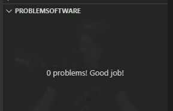
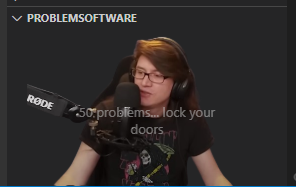

# ProblemSoftware

Problems in your software? PirateSoftware will be there to remind you to not code like him!

## Features

Adds a view container with a lovely picture of PirateSoftware in his natural habitat.

As your problems increase, so will he.

Also adds some encouraging messages to motivate you to fix your problems.

## Extension Settings

This extension contributes the following settings:

- `problemsoftware.maxProblemCount`: Maximum number of problems before PirateSoftware eats your soul.

Also adds a nifty command to set it as well:

- `ProblemSoftware: Set Maximum Problem Count`
